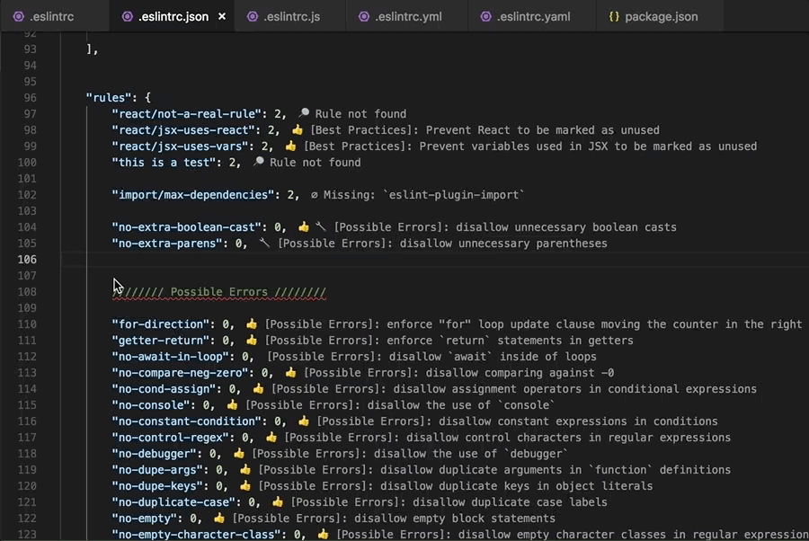
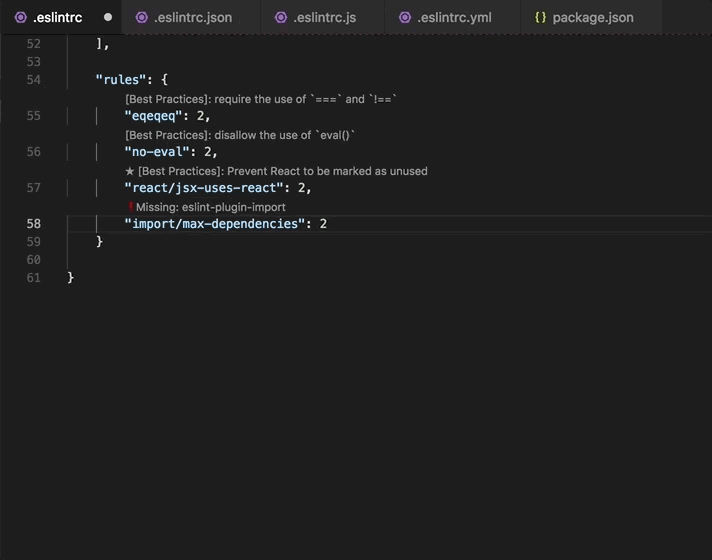

# ESLint Rules Metadata

Augment your ESLint rules in Visual Studio Code - Adds descriptions above each ESLint rule via code lenses.

## Features

Adds details and a documentation link above each [ESLint rule](https://eslint.org/docs/rules/) (including [plugins](https://www.npmjs.com/search?q=eslint-plugin-&ranking=popularity)) in your configuration file located anywhere in your workspace (supports multiple config files).

Supports all configuration file formats currently [supported by ESLint](https://eslint.org/docs/user-guide/configuring#configuration-file-formats)

- JavaScript - use `.eslintrc.js` and export an object containing your configuration.
- YAML - use `.eslintrc.yaml` or `.eslintrc.yml` to define the configuration structure.
- JSON - use `.eslintrc.json` to define the configuration structure. ESLint’s JSON files also allow JavaScript-style comments.
- Deprecated - use `.eslintrc`, which can be either JSON or YAML.
- package.json - create an `eslintConfig` property in your `package.json` file and define your configuration there.

If you are new to ESLint check the [documentation](http://eslint.org/).  

Auto-updates as you type:

Click for more information on each rule:

## Requirements

The extension uses the ESLint library and plugins installed in the opened workspace folder(s).  If ESLint is not installed locally, the extension uses its own installed version (currently `^5.1.0`).  Due to restrictions in vscode, this extension does not support globally installed packages.

## Known Issues

- Does not support globally installed eslint or eslint plugin packages
- When using the JS configuration file format, this extension currently only supports rules existing in a single exports object at the root (`module.exports.rules`).
